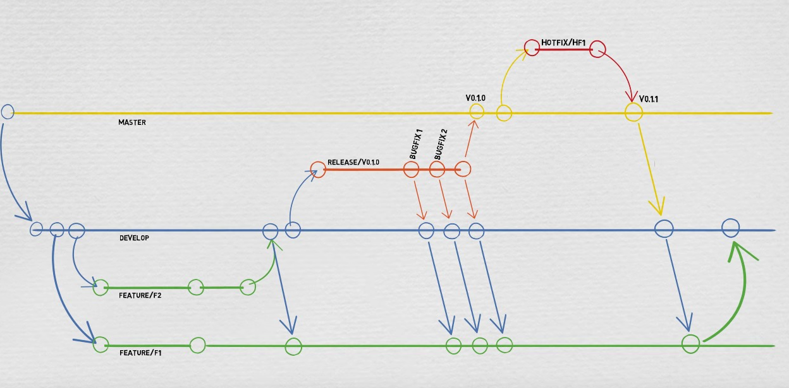

# OSI-CHESS

## Membri del team

- Marco Coppola 0001020433 marco.coppola3@studio.unibo.it                 RUOLO: Developer, Backend, Sysadmin
- Valerio Pio De Nicola 0001043353 valeriopio.denicola@studio.unibo.it    RUOLO: Product Owner, Frontend, Backend
- Chiara Tosadori 0001043695 chiara.tosadori@studio.unibo.it              RUOLO: Developer, Frontend, Scrum Master
- Bogdan Chirila  0001028516  bogdan.chirila@studio.unibo.it              RUOLO: Analista delle prestazioni
- Ahmed Niouer  0001027288 ahmed.niouer@studio.unibo.it                   RUOLO: Designer, UI/UX

## Descrizione del sistema

L'obbiettivo è quello di realizzare un'applicazione web per giocare alla variante di scacchi denominata
"Really Bad Chess". L'applicazione permetterà all'utente di poter giocare sia contro un bot con vari livelli
di difficoltà che contro un altro giocatore. Durante la creazione della partita esiste un meccanismo
di stanze pubbliche (il primo che entra dal link generato gioca) e stanze private (si entra solo se invitato)
al termine della partita sarà possibile condivere il risultato su un social network e permettere quindi
ad altre persone di commentare.

Sarà inoltre possibile per chi crea una partita determinare la sua durata massima
per permettere ai giocatori di personalizzare la loro esperienza.

I risultati delle partite verranno salvati in una classifica e sarà sempre possibile per il giocatore vedere
i top player e la loro posizione globale che sarà principalmente basata sul numero di vittorie ottenute.
Sarà disponibile per il giocatore una sezione privata in cui potrà monitorare le sue statistiche e i suoi risultati
delle partite giocate contro altri giocatori, per verificare il suo miglioramento o peggioramento.
Tra le statistiche visibili nella classifica abbiamo deciso di includere:
numero di vittorie e sconfitte, numero di mosse impiegate per fare scacco matto, tempo impiegato per vincere.

## Note

- L'ultima versione dell'app stabile, presa dal branch main é disponibile su https://osichess.murkrowdev.org/
- Comunicazione tra i membri del gruppo effettuata su un gruppo privato di Telegram.
- Gestione della repository Git effettuata tramite Gitlab (self-hosted) https://git.murkrowdev.org/
- Gestione delle user stories effettuata tramite Taiga (self-hosted) https://taiga.murkrowdev.org/
- Gestione delle task effettuata tramite Mattermost (self-hosted) https://mattermost.murkrowdev.org/
- Analisi del codice e delle vulnerabilità effettuate tramite SonarQube (self-hosted) https://sonarqube.murkrowdev.org/
- Uno Scrum circa ogni due giorni, alla fine di ogni scrum i membri del team hanno a disposizione delle task da completare
  scelte tutti insieme.

### Tech Stack
- Linguaggi di programmazione:
  - Front-end:
    - HTML
    - CSS
    - Javascript
  - Back-end:
    - PHP
- Librerie/Framework:
  - Front-end:
    - Framework:
      - React
    - Librerie:
      - chess.js:
        - https://github.com/jhlywa/chess.js/tree/master
      - chessboard.jsx:
        - https://github.com/willb335/chessboardjsx
      - React bootstrap:
        - 
  - Back-end:
    - Laravel
    - StockFish (chess bot)
      - https://stockfishchess.org
- DBMS:
  - MariaDB
- Utility:
  - Docker
    - Utilizzato per containerizzare tutti i servizi necessari per il progetto
  - draw.io
    - Utilizzato per realizzare lo schema architetturale del progetto
  - Figma
    - Utilizzato per realizzare il mockup dell'interfaccia grafica

## Gitflow

Per ogni "task" del progetto Taiga, aprire una "issue" su questa repository di Gitlab e assegnarla al membro del team che deve
eseguirla.  
Per lo sviluppo di ogni issue, creare un branch di nome "#numeroissue" dal branch "development".  
Una volta che l'issue è stata completata, eseguire il merge di "#numeroissue" in "development".
Nominare i branch dei rilasci "release/sprint0", "release/sprint1", e così via, al posto di "release/V0.1.0".

## Installazione
Guardare il file README situato in code/osi-chess-app/README.md